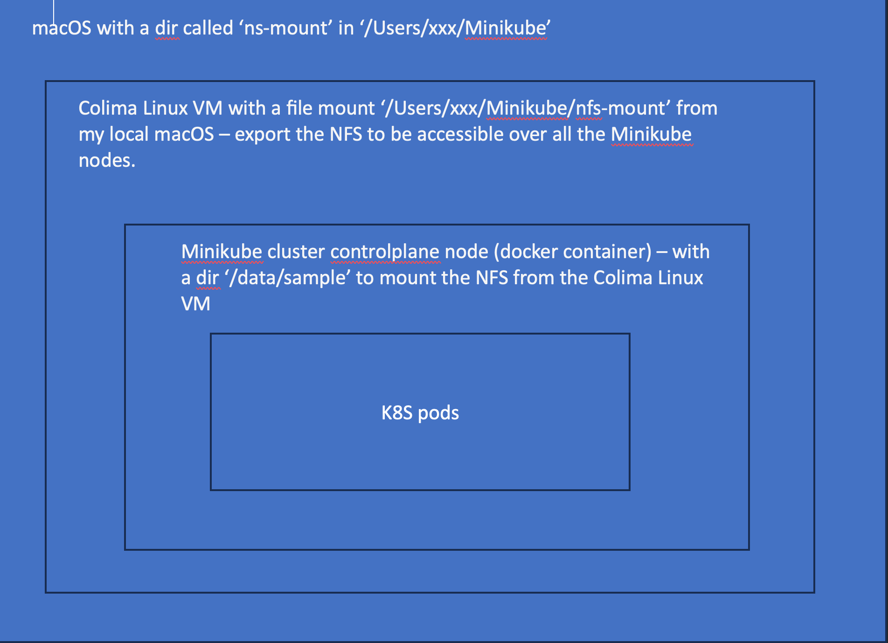

# local-minikube-mac

This repo is used to set up a local Multi-node Minikube Kubernetes environment on a Mac with M2 chip.

## References

* https://techexpertise.medium.com/multi-node-minikube-k8s-deployment-on-m1-mac-with-colima-and-nfs-pv-762bcf08ac08
* https://askubuntu.com/questions/799289/how-to-install-a-telnet-client
* https://www.digitalocean.com/community/tutorials/how-to-set-up-an-nfs-mount-on-ubuntu-22-04

## Why Minikube

* Minikube supports multi-node clusters.
* Minikube support both vm-based and container-based approaches to provision the cluster.

## Why Colima

* We need a solution which can run dokerd (Docker Daemon) aka Docker Runtime on a Mac with M2 chip without installing Docker Desktop.
* Colima refers to Containers in Linux virtual machines on macOS.

## What to install or create

* colima
* docker
* docker-compose
* Minikube
* Create a dir called `nfs-mount` in `/Users/xxx/Minikube` in my Mac

## Architecture

Running K8S in docker or docker in docker



## How to setup

### 1. Create a colima Linux VM with a mount from my local macOS host

Run the following commands on my Mac terminal.

```bash
colima start -p linux-vm
colima ssh -p linux-vm
colima list
colima status -p linux-vm

```

Make sure in the profile `linux-vm` the mount points to `/Users/xxx/Minikube/nfs-mount` which is created above.

### 2. Start Minikube

Run the commands on my Mac terminal.

```bash

minikube start --nodes 2 --cpus 2 --memory 2048 --disk-size 10g --driver docker --container-runtime docker --namespace test -p multi-node

minikube profile multi-node

```

### 3. Create a NFS in colima Linux VM with a mount to Mac

* install the telnet client in the Linux VM which uses ubuntu OS
  
```bash
apt-get update 
apt-get install telnet
```

* install the NFS server in the Linux VM which uses ubuntu OS

```bash
apt-get install nfs-kernel-server
```

* install vim in the Linux VM which uses ubuntu OS

```bash
apt-get install vim
```  

* Configure the NFS exporting by editing the /etc/exports file with vi

```bash
vi /etc/exports

```

Add the following line to the /etc/exports file

```bash
/Users/xxx/Minikube/nfs-mount 192.168.49.0/24(rw,sync,no_subtree_check,fsid=0)

```

`192.168.49.0/24` is the IP range of Minikube

### 4. Test mount NFS to Minikube nodes

Run the following commands on the K8S controlplane node

```bash
minikube ssh -n multi-node
sudo mkdir /data/sample
sudo mount -t nfs -o vers=3 192.168.49.1:/Users/xxx/Minikube/nfs-mount /data/sample 
sudo echo "Test" >> /data/sample/test.txt

```

`192.168.49.1` is the gateway IP address of the controlplane node

Check whether the file `test.txt` is created on the Mac filesystem under `/Users/xxx/Minikube/nfs-mount` directory.

### 5. Create K8S PV,PVC and Deployment

Run the following commnas on my Mac terminal

* Create a PV with a NFS share
  
```bash

kubectl apply -f standard-host-path-nfs-manual-pv.yaml

```

* Create a PVC

```bash
kubectl create ns test
kubectl apply -f standard-host-path-nfs-manual-pvc.yaml
```

* Create a deployment with a volumeMount which uses the PVC created above

```bash

kubectl create -f standard-host-path-nfs-manual-pvc-deployment.yaml

```

Pod will execute the following shell script which will write the current time and hostname of the pod to the `/my-test/shared.txt` file within the pod.

we can see data written by both pods to the `/Users/xxx/Minikube/nfs-mount` directory on Mac host machine.
